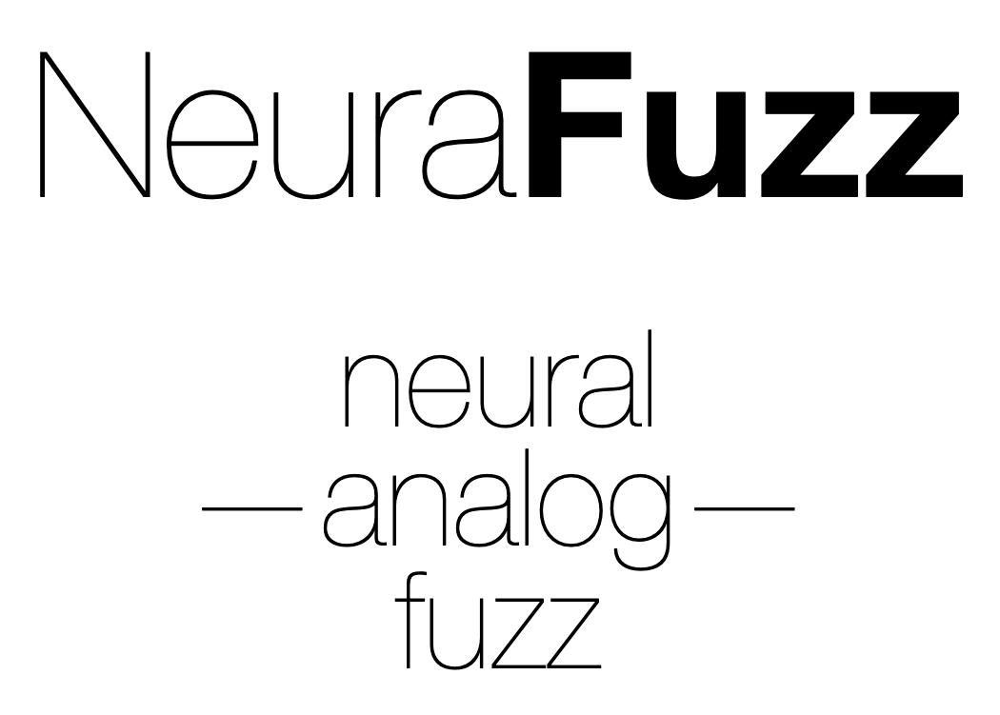

<div align="center">

</div>

<div  align="center">

[Paper](https://arxiv.org/abs/2211.00497) | [Dataset (restricted access)](https://zenodo.org/record/7766959)

</div>

## Neutone Model
If you simply want to use NeuraFuzz in a DAW, follow these instructions:

* Download and install the [Neutone Plugin](https://neutone.space/plugin/).
* Open your favourite DAW
* Set sample rate at 48kHz (sample frequency used to train NeuraFuzz)
* Set buffer size. Suggested: 512, 256.
* Open the Neutone plugin and load the NeuraFuzz model
* Enjoy!

The final model to run on the neutone plugin is in ```export_model/model_fuzzring_v1.0.0.nm```

## Setup
If you want to run the code and experiment with it, install the requirements.
```
python3 -m venv .venv
source .venv/bin/activate
python3 -m pip install -r requirements.txt
```


## Export Neutone Model
To export again the neutone model you can run ```src/gcntfilm_neutone_fuzzring.py```.


## Modify the NeuraFuzz
In the current implementation NeuraFuzz includes the neural network that was trained on distortion, as well as a DSP implementation of a Ring Modulator. You can experiment with both. You can either train a new neural network on your favourite distortion, or you can modify the DSP code. Maybe you want to improve the ring modulator, or replace it with another effect.

Have fun with it! And let me know once you find a cool sound :wink:


## Pre-trained Model
You can find the pretrained best model in the ```results/1-GCNTF3-fuzz__1-10-16-3-2-128__prefilt-None-bs6``` folder. 

That is the model used to export the Neutone model.


## Dataset
You can access the dataset here: [Dataset (restricted access)](https://zenodo.org/record/7766959). 

You will need to update the root path in the training configuration (inside ```train.py```) before start the training.

## Training

If you would like to re-train the model, you can run the training script. The training results will be saved in the ```results``` folder.

```
python train.py
```

## Process Audio

To process audio using a trained model you can run the ```process_file_with_params.py``` script.


## Credits

General architecture:

[https://github.com/Alec-Wright/Automated-GuitarAmpModelling](https://github.com/Alec-Wright/Automated-GuitarAmpModelling)

[https://github.com/csteinmetz1/micro-tcn](https://github.com/csteinmetz1/micro-tcn)

Temporal FiLM: 

[https://github.com/kuleshov/audio-super-res](https://github.com/kuleshov/audio-super-res)
